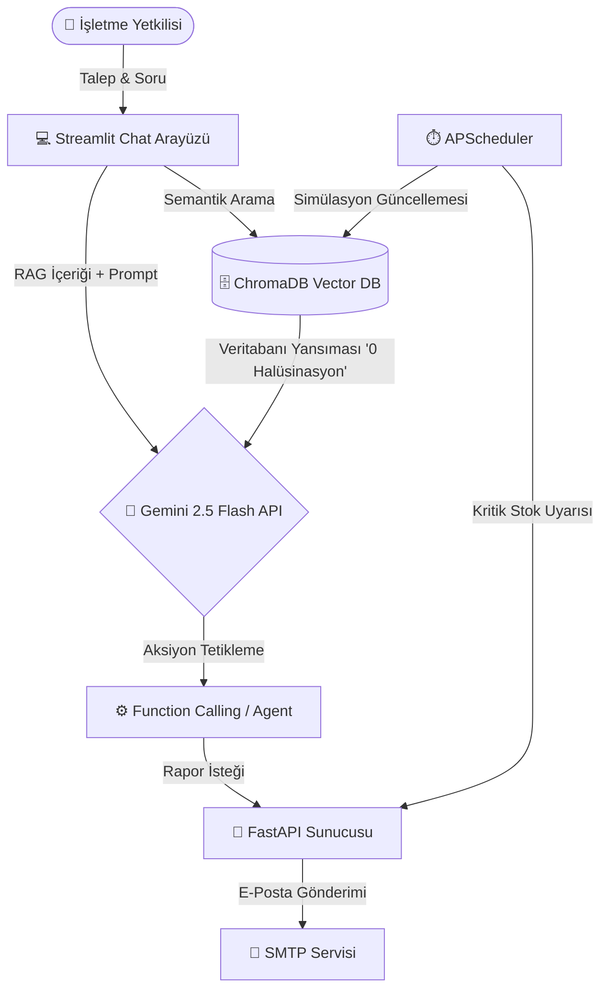

# KOBİ AI Yönetim Sistemi (Business Assistant)

🤖 **Yapay Zeka Destekli Akıllı İşletme Yönetim ve Otomasyon Platformu**

Bu proje, KOBİ'lerin ve kooperatiflerin operasyonel süreçlerini (stok denetimi, sipariş takibi ve görev yönetimi) yapay zeka destekli otonom sistemlerle kolaylaştırmayı hedefleyen bir **Hackathon** projesidir.

## 🌟 Temel Özellikler

- **AI Agent Mimarisi (Function Calling):** Sistem sadece klasik bir soru-cevap botu (RAG) olmakla kalmaz. Kullanıcının talepleri doğrultusunda arka planda gerçek işlemler (örn. "bana raporu mail at") yürütebilir.
- **RAG Tabanlı Asistan:** Veritabanındaki tüm stok, sipariş ve görev bilgilerine anlık olarak erişen, işletme verileriniz üzerinden soruları sıfır halüsinasyon ile yanıtlayan Gemini destekli akıllı asistan.
- **Gerçek Zamanlı Veri Simülasyonu:** Arka planda çalışan zamanlanmış görevler (APScheduler) stokları, sipariş durumlarını ve görev geçişlerini simüle eder.
- **Otonom Uyarı ve Raporlama:**
  - 🚨 *Kritik Stok Uyarısı:* Stok miktarı belirli bir seviyenin (örn: 5) altına düştüğünde yetkililere anında e-posta uyarısı gönderir.
  - 📊 *Günlük Özet Raporu:* Her gün belirlenen saatte (veya istendiğinde anlık olarak) HTML formatında şık bir durum raporunu işletme sahibine gönderir.
- **Kapsamlı Vektör Veritabanı:** Tüm işletme belgeleri (Stok, Sipariş, Görev) ChromaDB üzerinde vektörel olarak saklanır ve anında anlamsal aramalar yapılabilir.

## 🧩 Sistem Mimarisi

Aşağıdaki şema, kullanıcı etkileşiminden veritabanı yansımasına ve asistanın arka uç (backend) ile kurduğu Agent (otonom işlem) ilişkisine kadar sistemin genel akışını göstermektedir.



- **Streamlit (Ön Uç):** Kullanıcının etkileşime girdiği AI sohbet arayüzü ve entegre veri paneli.
- **RAG & ChromaDB:** Stok, Sipariş gibi belgelerin metinsel bağlamı ile birlikte *birebir metadata yansımasını* Gemini'a aktararak sayısal / analitik sorularda modelin hata (halüsinasyon) yapmasını kesin olarak önler.
- **Agent Modülü (Function Calling):** Asistan metin üretmenin ötesine geçer. "Bana raporu maille" direktifini tespit eder, arkaplandaki yerleşik `send_email_action` fonksiyonunu tetikler ve işlemi bitirip sonucu kullanıcıya bildirir. (Actionable Agent Mimarisi).
- **Arka Plan Simülasyonu (APScheduler):** İşletmedeki olayları (stok düşüşü, sipariş tamamlama) belirli saniye periyotlarında simüle eder ve senkron analizlerle kritik seviyedeki ürünleri anında mail olarak raporlar.

## 🏗️ Kullanılan Teknolojiler (Tech Stack)

- **Backend:** Python 3.11, FastAPI, Uvicorn
- **Veritabanı:** ChromaDB (Persistent Vector DB)
- **Yapay Zeka:** Google Gemini API (gemini-2.5-flash), Function Calling (Tools)
- **Arayüz:** Streamlit
- **Otomasyon & Görevler:** APScheduler
- **Bildirim:** smtplib, email.mime (SMTP üzerinden HTML mail)

## 🚀 Kurulum & Çalıştırma

### 1. Gereksinimleri Yükleyin
Sistemin doğru çalışması için **Python 3.11** kullanılması önerilir.
```bash
python -m venv venv
# Windows:
venv\Scripts\activate
# Mac/Linux:
# source venv/bin/activate

pip install -r requirements.txt
```

### 2. Çevre Değişkenlerini (Environment Variables) Ayarlayın
Proje ana dizinine bir `.env` dosyası oluşturun:
```env
GEMINI_API_KEY=senin_gemini_api_anahtarin
EMAIL_SENDER=senin_mail_adresin@gmail.com
EMAIL_PASSWORD=uygulama_sifren_16_karakter
EMAIL_SMTP_SERVER=smtp.gmail.com
EMAIL_SMTP_PORT=465
EMAIL_RECIPIENT=alici_mail@gmail.com
```
*(Gmail kullanıyorsanız, Google Hesabınızdan "Uygulama Şifreleri" oluşturmanız gereklidir.)*

### 3. Uygulamayı Başlatın
**FastAPI Sunucusunu ve Arka Plan Görevlerini (Simülasyon/Rapor) Başlatmak İçin:**
```bash
python main.py
```
*API http://localhost:8000 adresinde, dokümantasyon ise http://localhost:8000/docs adresinde çalışacaktır.*

**Streamlit AI Asistan Arayüzünü Başlatmak İçin (Yeni bir terminalde):**
```bash
streamlit run chatbot_ui.py
```
*Asistan arayüzüne http://localhost:8501 üzerinden erişebilirsiniz.*

## 💡 Kullanım Senaryoları

- **Soru Sorun:** *"Kaç adet laptop stokumuz var?"* veya *"Ahmet Yılmaz'ın sipariş durumu nedir?"*
- **İşlem Yaptırın (Agent Mode):** *"Bana güncel işletme raporunu e-posta olarak atar mısın?"* dediğinizde Gemini, mail gönderme fonksiyonunu otonom olarak tetikler ve işlem bitince size bilgi verir.
- **Otomatik Uyarılar:** Proje çalışırken stok simülasyonu çalışır. Stok 5'in altına düştüğünde sistem otomatik olarak bildirim adresine acil e-posta geçer.

## 🎯 Hackathon Odak Alanları

Bu proje, değerlendirme kriterlerindeki **"Sadece Bilgi Sunan Değil İşlem Gerçekleştirebilen Sistemler"** vizyonunu ve aşağıdaki odak alanlarını hedefler:
- **Alan 4 — Stok ve Envanter Yönetimi:** Kritik stok takibi, anlık veritabanı yansıması ile sıfır halüsinasyon veri tutarlılığı.
- **Alan 5 — İş Akışı ve Görev Yönetimi:** Otomatik durum raporları, otonom e-posta gönderimi ve asistan kontrollü operasyonlar.